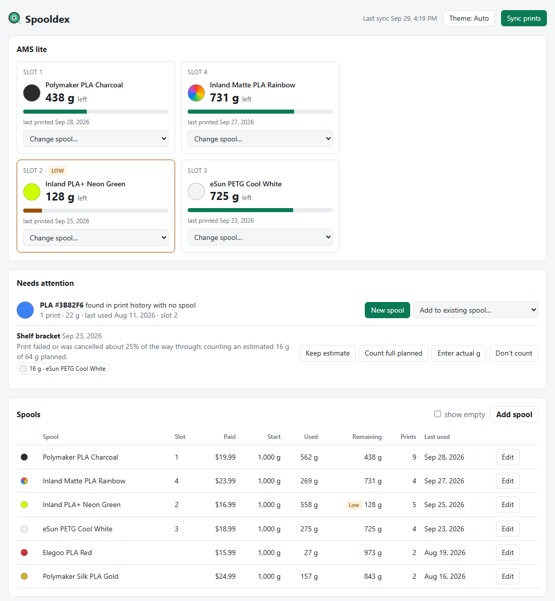
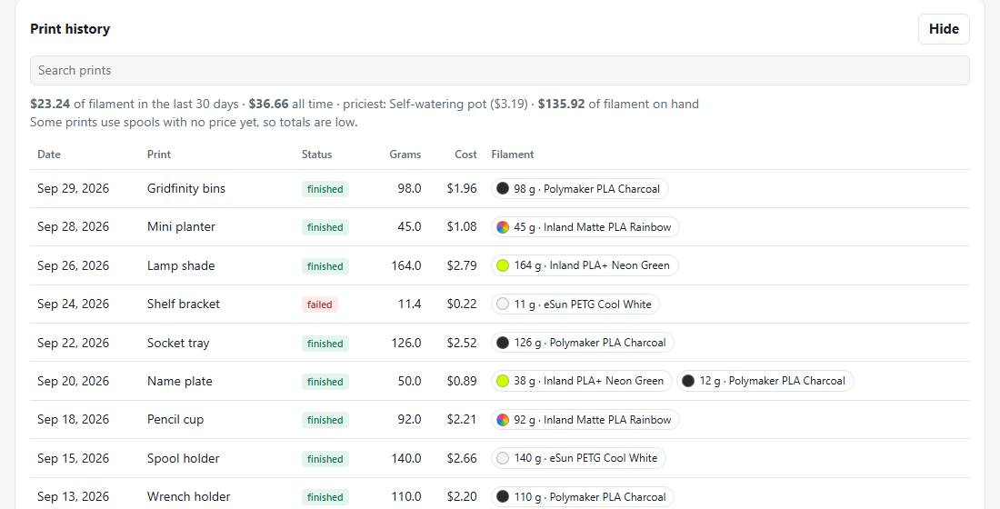
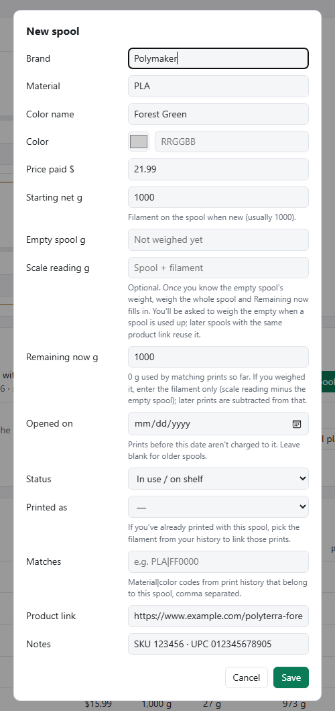
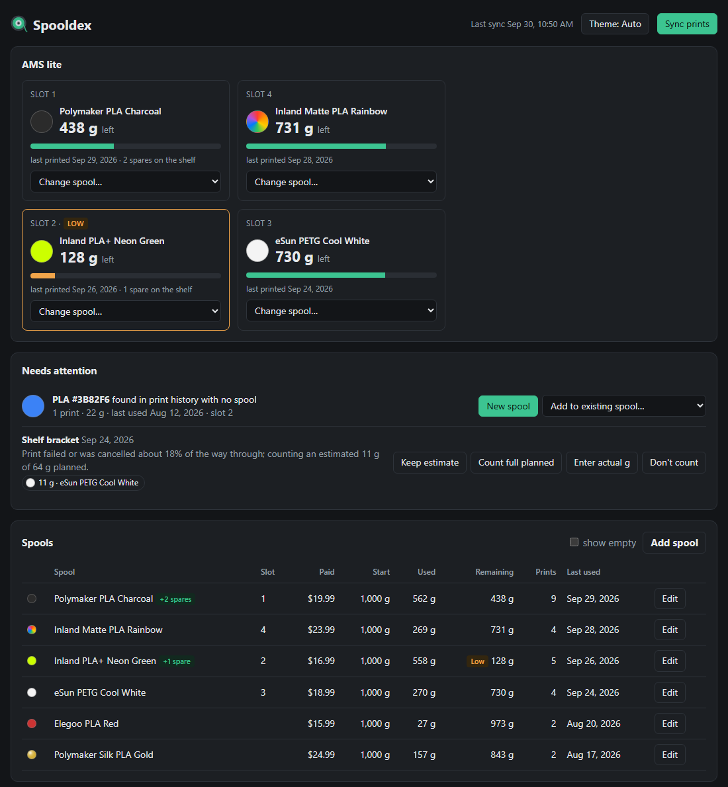

# Spooldex

A small Windows tool that keeps a filament inventory for a Bambu Lab printer up to date from your
**Bambu Cloud print history**. It works with third-party spools (no RFID needed) and keeps cloud
printing from Bambu Studio working, since it never talks to the printer directly.

- Rebuilds each spool's remaining grams from past prints, then charges every new print automatically.
- Syncs when you open the page and at Windows logon, so nothing has to be running when a print finishes.
- Shows what's in each AMS lite slot, flags low spools, estimates cancelled prints and per-print cost.
- Adds spools from store product pages with a one-click bookmark.
- Pure PowerShell 5.1 plus one HTML page; nothing to install. Everything stays on your PC.

Spooldex is an independent project and is not affiliated with or endorsed by Bambu Lab.



<details>
<summary>More screenshots</summary>

**Print history with per-print cost**



**Adding a spool from a store page with the bookmark**



**Dark theme**



</details>

Screenshots use the built-in demo data. To try it yourself without a Bambu account, run
`powershell -ExecutionPolicy Bypass -File Spooldex.ps1 -Demo`.

## Setup

1. Double-click **`Login.cmd`** and sign in with your Bambu account email. If you sign in to Bambu with
   Google or Apple, leave the password blank and enter the one-time code Bambu emails you. A password, if
   you use one, is sent only to Bambu and never stored; the returned access
   token is saved in `%USERPROFILE%\Spooldex\token.xml`, encrypted with Windows DPAPI so only your Windows account can read it.
   The token lasts about 3 months; the page warns you before it expires.
2. Run `Install.ps1` (right-click → Run with PowerShell) to create:
   - a **Spooldex** desktop shortcut that opens the page, and
   - a Startup shortcut that syncs quietly at logon.
3. Open the page. Filaments found in your history appear under **Needs attention**. Choose **New spool**
   for each, fill in brand/color name/starting weight, and it picks up every matching past print.
   If a total looks off, type the filament left into **Remaining now** (or, once you know the empty spool
   weight, the whole-spool **Scale reading**). That becomes a checkpoint: only prints after it are
   subtracted. Marking a spool **Used up** asks for the empty spool's weight, which later spools with the
   same **Product link** reuse. The product link also makes the spool's name link to its store page.

## How prints are matched to spools

Bambu's history records, for each filament a print used, the material, the color of the AMS slot it fed
from, and the slicer's gram estimate. Each spool has one or more *match keys* (`PETG|000000`); a print is
charged to the spool whose key matches and whose "opened on" / "used up" dates cover the print. If two
spools could match, the print is flagged for you to choose. Add a second key to a spool when the same
spool was printed under two slot colors.

The AMS lite panel shows whatever the most recent print through each slot used, or a spool you picked
from the slot's menu if that is newer.

Failed or cancelled prints are estimated from how long they ran against the slicer's time estimate,
minus the startup time (heating and calibration, 6 min by default, adjustable at the bottom of the page)
that extrudes nothing: cancelled 36 min into a 2 h print counts ~25% of the planned grams, and a print
cancelled during calibration counts nothing. They're flagged so you can keep the
estimate, count the full amount, enter weighed grams, or not count it. Any print's filament can be
reassigned or its grams edited by clicking it in the history.

When a spool runs out, set its status to **Used up** and add the new one with an **Opened on** date, even if
it's the same color.

## Adding spools from store pages

Drag the **Send to Spooldex** button (bottom of the page) to your bookmarks bar. On a filament
product page, click it: it reads the page's standard schema.org product data in your own browser and
opens a pre-filled New spool dialog in the tracker (brand, material, color, weight, price, link, SKU/UPC).
Nothing is saved until you press Save. Use **Printed as** to link prints you've already made with it.
Stores that don't publish product data still get the title and link.

## Cost

Enter the price paid for a spool (in its Edit dialog) and each print shows an estimated filament cost:
grams × price ÷ the spool's starting net grams. The print history shows totals for the last 30 days and
all time, the priciest print, and the value of filament still on hand.

## Notes

- Bambu Cloud keeps roughly 90 days of history. Once a print is synced it is stored locally forever, but
  anything older than that window before your first sync can only be accounted for by correcting the
  remaining weight.
- Grams are slicer estimates, not measured usage.
- The Bambu Cloud API is unofficial and could change.
- Your data lives in `%USERPROFILE%\Spooldex\` (`tracker.json`, a daily backup in `backups\`, the
  encrypted token and a sync log), outside the program folder, so it can't be committed by accident.

## Command line

```
Spooldex.ps1              # serve the page on http://localhost:8765 and open it
Spooldex.ps1 -SyncOnly    # pull new prints and exit
Spooldex.ps1 -Login       # sign in to Bambu Cloud
Spooldex.ps1 -TasksFile x # sync from a saved my/tasks JSON response (testing)
Spooldex.ps1 -Demo        # made-up spools and prints on port 8766; your real data is untouched
```

The page follows Windows' light/dark setting; the **Theme** button in the header switches between
Auto, Light and Dark.
